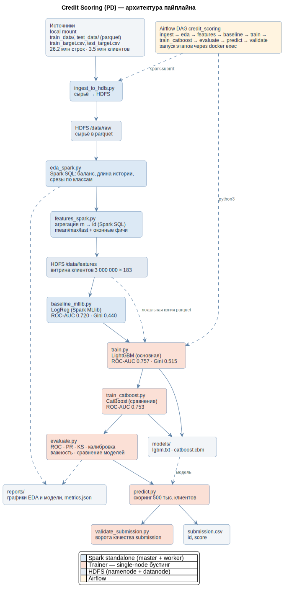

# Credit Scoring (PD)

Задача: по кредитной истории клиента предсказать, уйдёт ли он **в дефолт** (перестанет платить).

End-to-end пайплайн предсказания дефолта заёмщика по истории кредитных продуктов бюро. Проект - витрина стека **HDFS → Spark → LightGBM → Airflow**.

## Результат
| Модель | ROC-AUC | Gini | PR-AUC | KS |
|---|---|---|---|---|
| Spark MLlib LogReg (baseline) | 0.720 | 0.440 | 0.085 | - |
| CatBoost | 0.753 | 0.507 | 0.110 | - |
| **LightGBM (основная)** | **0.757** | **0.515** | **0.113** | **0.381** |

Метрики - на общей отложенной валидации (≈599 тыс. клиентов, из них 21 004 дефолта);
все три модели обучены на одной витрине и одном сплите. По test-holdout (500 тыс.)
сгенерирован `submission.csv` формата `id,score`. Сплит воспроизводим (по хешу `id`),
поэтому цифры стабильны между прогонами.

Оба бустинга уверенно обходят линейный baseline: **+0.037 ROC-AUC** у LightGBM и **+0.033** у
CatBoost. Между собой идут вровень - разрыв всего 0.004, LightGBM чуть впереди. Это ожидаемо:
признаки уже непрерывные агрегаты, и категориальная сила CatBoost здесь не задействована.
В submission идёт LightGBM.

## Задача и данные
Гранулярность сырья - кредитный продукт (`id`+`rn`), нужно предсказание на уровне
клиента, поэтому история агрегируется `rn → id` в Spark. Целевая метрика - **ROC-AUC/Gini**
(дисбаланс классов 3.55%).

| Объект | Что | Размер |
|---|---|---|
| `train_data/*.pq` | история продуктов, 59 анонимных закодированных фич | 12 файлов, 26.2 млн строк |
| `train_target.csv` | `id, flag` | 3 000 000 клиентов, 3.55% дефолтов |
| `test_data/*.pq` + `test_target.csv` | история теста без меток | 500 000 клиентов |

### Куда положить данные
Данные (~700 МБ) **не хранятся в репозитории** - они в `.gitignore`. Перед запуском положите
их в корень проекта ровно так:

```
mlif/
├── train_data/          # 12 файлов *.pq
├── test_data/           # 2 файла *.pq
├── train_target.csv
└── test_target.csv
```
Без них `ingest` упадёт на первом же шаге. Пути прописаны в [`src/config.py`](src/config.py) -
если данные лежат иначе, поправьте там.

## Архитектура

<p align="center">
  
</p>

Сырьё из локального маунта загружается в **HDFS**, там же живёт клиентская витрина.
Тяжёлые этапы (ingest, EDA, агрегация `rn→id`, baseline) выполняет **Spark** на кластере
`master + worker`; градиентный бустинг - single-node, в отдельном контейнере `trainer`.
Всё связывает **Airflow DAG**, запускающий этапы через `docker exec` в нужный контейнер.

## Стек
Python · Spark standalone (Docker) · HDFS · Airflow · LightGBM · CatBoost · Spark SQL · Git

## Структура
```
mlif/
├─ docker/
│  ├─ docker-compose.yml     # HDFS + Spark + trainer(ml) + Airflow(airflow)
│  ├─ Dockerfile.spark       # apache/spark + lightgbm/catboost/sklearn
│  ├─ Dockerfile.airflow     # airflow + docker SDK
│  └─ hadoop.env
├─ src/
│  ├─ config.py              # пути HDFS/локальные + Spark-сессия
│  ├─ data_io.py             # память-эффективная загрузка витрины (float32 по частям)
│  ├─ viz.py                 # единый стиль графиков
│  ├─ ingest_to_hdfs.py      # сырьё → HDFS
│  ├─ eda_spark.py           # EDA (Spark SQL) → reports/eda
│  ├─ features_spark.py      # агрегация rn→id → витрина
│  ├─ baseline_mllib.py      # Spark MLlib LogReg
│  ├─ train.py               # LightGBM (основная модель)
│  ├─ train_catboost.py      # CatBoost (сравнение)
│  ├─ evaluate.py            # метрики + графики → reports/model
│  ├─ predict.py             # скоринг test → submission.csv
│  └─ validate_submission.py # ворота качества: проверка submission
├─ dags/credit_scoring_dag.py# Airflow DAG
├─ docs/                     # диаграмма архитектуры (.puml + .svg)
├─ Makefile                  # ярлыки команд (опционально, нужен GNU make)
│
│  # входные данные - кладутся вручную, в git не хранятся
├─ train_data/  test_data/  train_target.csv  test_target.csv
│
│  # порождается пайплайном
├─ data/                     # локальная копия витрины + valid-предсказания
├─ models/                   # lgbm.txt, catboost.cbm + список признаков
├─ reports/                  # графики (eda/, model/), metrics.json, ОТЧЁТ.md
└─ submission.csv            # предсказания по test
```

## Запуск

Нужен только **Docker Desktop** - Spark, Hadoop и Airflow ставить не надо, они приедут в образах.

### Память (важно)
Стек требует **12 ГБ** RAM у Docker. Windows по умолчанию отдаёт WSL2 только ~8 ГБ - этого
**не хватит**, `train` упадёт по OOM. Создайте `C:\Users\<вы>\.wslconfig`:
```ini
[wsl2]
memory=12GB
processors=6
swap=4GB
```
затем закройте Docker Desktop (**Quit**, не крестиком), выполните `wsl --shutdown` и запустите
Docker Desktop заново. Проверка: `docker info --format '{{.MemTotal}}'` → ~12.5e9.

### Инфраструктура
```bash
COMPOSE="docker compose -f docker/docker-compose.yml --profile ml --profile airflow"

$COMPOSE build     # собрать образы (первый раз тянет базовые, ~10-20 мин)
$COMPOSE up -d     # поднять весь стек (8 контейнеров)
$COMPOSE ps        # проверить статус
$COMPOSE down      # остановить (данные в HDFS сохранятся)
```
(если установлен GNU make - те же команды доступны как `make build` / `make up` / `make down`)

Поднимается 8 контейнеров:

| Контейнер | Роль |
|---|---|
| `namenode` + `datanode` | **HDFS** - распределённое хранилище |
| `spark-master` + `spark-worker` | **Spark** - ETL и агрегация 26 млн строк |
| `trainer` | обучение **LightGBM** и **CatBoost** (pandas, single-node) |
| `airflow-webserver` / `-scheduler` / `-db` | **Airflow** - оркестрация шагов |

### Пайплайн через Airflow
```bash
docker exec airflow-scheduler airflow dags unpause credit_scoring
docker exec airflow-scheduler airflow dags trigger credit_scoring

# статус прогона
docker exec airflow-scheduler airflow dags list-runs -d credit_scoring -o plain
```
Или в UI: http://localhost:8090 (`admin`/`admin`) → включить DAG `credit_scoring` → **Trigger**.
Полный прогон - **~20 минут** (замер: ~1180 c на 4 ядрах). Самые долгие шаги - `train` (~9 мин)
и `features` (~4 мин).

### Пайплайн вручную (по шагам, без Airflow)
```bash
SUBMIT="docker exec spark-master /opt/spark/bin/spark-submit --master spark://spark-master:7077"
$SUBMIT src/ingest_to_hdfs.py
$SUBMIT src/eda_spark.py
$SUBMIT src/features_spark.py
$SUBMIT src/baseline_mllib.py
docker exec trainer python3 src/train.py
docker exec trainer python3 src/train_catboost.py
docker exec trainer python3 src/evaluate.py
docker exec trainer python3 src/predict.py
docker exec trainer python3 src/validate_submission.py
```

## Порты
| Сервис | URL |
|---|---|
| HDFS NameNode UI | http://localhost:9870 |
| Spark master UI | http://localhost:8080 |
| Airflow UI | http://localhost:8090 |

Если UI отдаёт `ERR_EMPTY_RESPONSE`, а контейнер жив - слетел проброс портов Docker Desktop
(бывает после перезапуска WSL). Лечится: `docker restart namenode spark-master airflow-webserver`.

## Что получается на выходе

| Артефакт | Что это |
|---|---|
| `reports/model/metrics.json` | итоговые метрики (ROC-AUC, Gini, PR-AUC, KS) |
| `reports/eda/` | **5 графиков** про данные (баланс классов, длина кредитной истории, срезы по классам) + `eda_summary.json` |
| `reports/model/` | **8 графиков** про модель: ROC, PR, KS, калибровка, важность признаков, матрица ошибок, сравнение 3 моделей |
| `models/lgbm.txt` / `models/catboost.cbm` | обученные модели (LightGBM в submission, CatBoost для сравнения) |
| `submission.csv` | предсказания по test-holdout, 500 тыс. строк |
| `reports/model/submission_check.json` | результат автоматической проверки submission |

Формат `submission.csv` - вероятность дефолта от 0 до 1 (чем ближе к 1, тем рискованнее клиент):
```
id,score
3000000,0.033
3000001,0.054
```

### Как проверяется качество
**Меток у test нет** - посчитать на нём AUC невозможно в принципе. Поэтому доверие строится
из двух независимых частей:

**1. Качество меряется на отложенной валидации** - ≈599 тыс. клиентов, которых модель не видела
при обучении. Отсюда все цифры в таблице результатов.

**2. Сам submission проходит автоматические ворота** - последний шаг DAG,
[`validate_submission.py`](src/validate_submission.py). Он **роняет пайплайн**, если:
все ли клиенты из `test_target` получили скор, нет ли дублей `id`, нет ли `NaN` и значений
вне `[0,1]`, не выродилась ли модель (сейчас 99.4% скоров уникальны), и - главное - не уехало
ли **распределение скоров** относительно валидации (дрейф среднего 5.5% при допуске 20%;
средний скор 0.033 против base rate 0.035).

Финальную объективную оценку даёт только лидерборд соревнования со скрытыми метками -
локально её получить нельзя, и никакой пайплайн этого не изменит.

## Инженерные решения

Самое интересное в проекте - не модель, а ограничения, из которых выросла архитектура.

**Spark для ETL, обычный Python для ML - и это не компромисс.**
Тяжёлая часть - агрегация 26 млн строк истории в витрину 3 млн клиентов; в pandas она не влезет,
Spark делает это распределённо. Но **после** свёртки данные ужимаются в 8.7 раза и занимают
~2 ГБ - на этом объёме single-node LightGBM и быстрее, и **точнее** распределённого Spark MLlib
(0.757 против 0.720). Поэтому бустинг вынесен в отдельный контейнер `trainer`, а Spark им не занимается.

**Загрузка витрины по частям с кастом во float32.**
`pandas.read_parquet` поднимает 3 млн × 183 как float64 - это **4.3 ГБ**, и процесс убивает OOM.
[`data_io.py`](src/data_io.py) читает каталог по одному part-файлу и кастует каждый в Arrow
**до** перевода в pandas: пик держится низким, итог - 2.1 ГБ.

**Агрегация выполняется один раз, а не три.**
Spark ленив: каждый `write`/`count` пересчитывает весь план. Исходно в
[`features_spark.py`](src/features_spark.py) было два `write` (в HDFS и локально) плюс `count()` -
groupBy по 26 млн строк гонялся **трижды**. Теперь витрина материализуется один раз в HDFS,
а локальная копия делается перечитыванием готового parquet. Замер: **≈2× быстрее** (было ~510 c).

**DAG линейный - и это осознанно.**
Пробовали разнести `eda`/`baseline` в параллельную ветку с `train` (разные контейнеры, за
executor'ы не конкурируют). Замерили: **1223 c против 1252 c** - выигрыш 2%, в пределах шума.
Причина: у машины 4 ядра, параллельные задачи просто делят те же ядра, а общий объём вычислений
не меняется. При этом `train` замедлился на 53%. Параллелизм оставлен закомментированным в
[DAG](dags/credit_scoring_dag.py) - он окупится на настоящем кластере, где задачи уедут на разные узлы.

**Воспроизводимость: сплит по хешу `id`, а не по позиции строки.**
`repartition()` раскидывает строки по партициям со случайным сдвигом, поэтому порядок строк
в витрине менялся от прогона к прогону - и вместе с ним «плавал» train/valid-сплит, а за ним
и метрики (±0.003 AUC). Теперь сплит считается от **хеша самого клиента** (splitmix64):
одна и та же выборка при любом порядке строк. Стратификация при этом не нужна - хеш независим
от метки, и доля дефолтов сохраняется сама (train 0.0354 / valid 0.0354).

**Устойчивость к перезапуску Docker.**
После рестарта namenode стартует в safe mode, и запись с `overwrite` падает. `ingest` теперь
**ждёт выхода из safe mode** (статус берётся из JMX namenode) и отказывается писать в
повреждённый HDFS, вместо того чтобы молча испортить данные.

## Ограничения и что дальше

Честно о слабых местах - их три, и первое самое важное.

**1. Агрегаты не полностью передают временную динамику.**
Основа витрины - `mean/max/last` по истории клиента, и такая свёртка **выбрасывает порядок**.
Частично это закрыто оконными функциями в Spark SQL (`LAG`-тренды и «свежесть» по последним
3 продуктам, см. [`features_spark.py`](src/features_spark.py)), но большая часть признаков -
всё ещё позиционно-независимые агрегаты. Между тем данные по своей природе
**последовательность** (`rn = 1, 2, 3...`), и сиквенс-модели (LSTM/трансформер над историей)
на этом датасете дают **~0.78 AUC** против наших 0.757.
**Главный резерв качества - не в смене бустинга, а в смене представления данных.**

**2. Категориальная сила CatBoost не задействована.**
Все 59 столбцов - это **закодированные категории**, а агрегаты усредняют их как числа.
CatBoost добавлен ([`train_catboost.py`](src/train_catboost.py)) и на этой же матрице дал
0.753 - вровень с LightGBM, но чуть позади. Его резерв - нативная обработка категорий:
если подать `_last`/`_max` кодовых столбцов как `cat_features` (а не усреднённые числа),
он мог бы вырваться вперёд. Сейчас сравнение честное «модель против модели» на одной матрице.

**3. Нет инкрементальности.**
Каждый прогон перечитывает все 26 млн строк заново. В проде обрабатывалась бы только новая
партиция (`/data/raw/dt=2026-07-12/`), а запись была бы транзакционной (Iceberg/Delta) - тогда
падение посреди джобы откатывалось бы, а не оставляло битые блоки в HDFS.

Тюнинга гиперпараметров тоже не делали - значения взяты разумные, но без подбора (Optuna).

## Отчёт
Подробные выводы EDA, разбор метрик и графиков - в [reports/ОТЧЁТ.md](reports/%D0%9E%D0%A2%D0%A7%D0%81%D0%A2.md).
