# Отчёт: PD-скоринг кредитного дефолта

## 1. Задача
Бинарная классификация: по истории кредитных продуктов клиента предсказать вероятность
дефолта (`flag=1`). Метрика - **ROC-AUC / Gini**, т.к. классы сильно несбалансированы и
важен ранжирующий скор, а не жёсткая метка. Accuracy здесь неинформативна (тривиальный
классификатор «всё 0» даёт 96.5%).

## 2. Данные
- 3 000 000 клиентов, **дефолтность 3.55%** (106 442 положительных).
- Признаки - история кредитных продуктов: **26.2 млн строк**, ~8.7 продукта на клиента,
  59 анонимных **порядково закодированных** признаков (просрочки, лимиты, платёжная
  дисциплина `enc_paym_0..24`, флаги `is_zero_*`).
- Пропусков нет.

## 3. EDA (Spark SQL)
**Баланс классов** - сильный перекос (3.55%), учтён метрикой и оценкой (PR-AUC/KS).
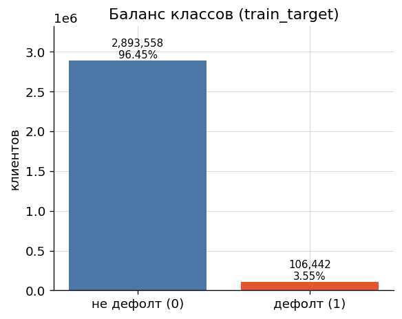

**Длина кредитной истории**: медиана 7, p90 = 18, максимум 58 продуктов.
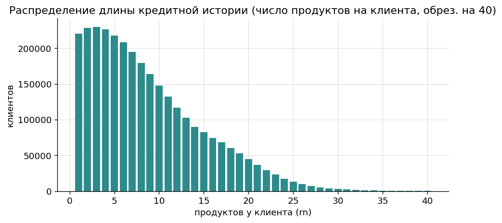

**Доля дефолта vs длина истории** - U-образная зависимость: у клиентов с очень короткой
историей (1–2 продукта) дефолтность ~5.2%, минимум ~3.0% при 12–15 продуктах, затем рост.
Длина истории - сильный признак.
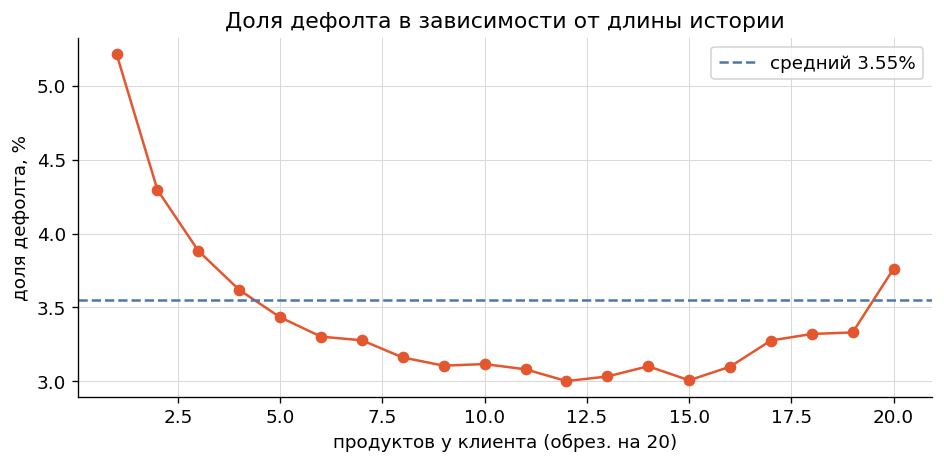

**Срез признаков по классам**: на уровне отдельной записи средние почти совпадают -
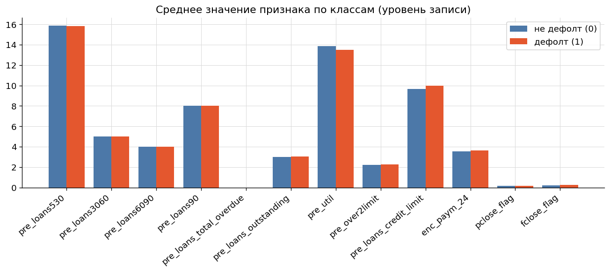
это ожидаемо, поскольку признаки **закодированы** (коды, не величины). Предиктивный сигнал
лежит в **распределении и частоте кодов** по истории клиента:
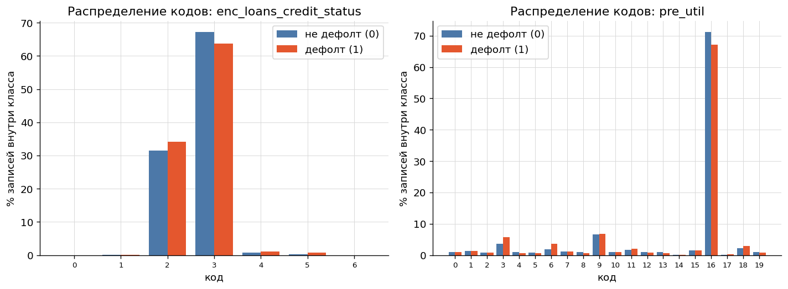
(у дефолтных заметно смещены распределения `enc_loans_credit_status` и `pre_util`).

**Вывод EDA:** одиночная запись малоинформативна → основа модели - **агрегация истории
клиента** (`rn → id`).

## 4. Признаки (Feature engineering, Spark SQL)
Витрина строится одним SQL-запросом. Базовая часть - по каждому из 59 столбцов агрегаты
**mean / max / last** (last = значение при максимальном `rn`, через `max_by`) + длина истории
`rn_cnt`. Дополнительно - **поведенческие признаки через оконные функции**: тренд
(`LAG(...) OVER (PARTITION BY id ORDER BY rn)`) и «свежесть» - среднее по последним 3 продуктам
(`MAX(rn) OVER (PARTITION BY id)`). Они возвращают в модель порядок истории, который простые
агрегаты теряют. Итог - витрина **3 000 000 × 183 признака**.

## 5. Модели
| Модель | ROC-AUC | Gini | PR-AUC | KS |
|---|---|---|---|---|
| Spark MLlib LogReg (baseline, взвеш. классы) | 0.720 | 0.440 | 0.085 | - |
| CatBoost | 0.753 | 0.507 | 0.110 | - |
| **LightGBM** | **0.757** | **0.515** | **0.113** | **0.381** |

Все три модели - на одной витрине и одном hold-out сплите. Бустинги обходят линейный baseline
на **+0.037 AUC** (LightGBM) и **+0.033** (CatBoost) за счёт нелинейных взаимодействий агрегатов.
Между собой идут вровень - разрыв 0.004, LightGBM чуть впереди; категориальная сила CatBoost не
задействована (признаки уже непрерывные агрегаты). В submission идёт LightGBM.
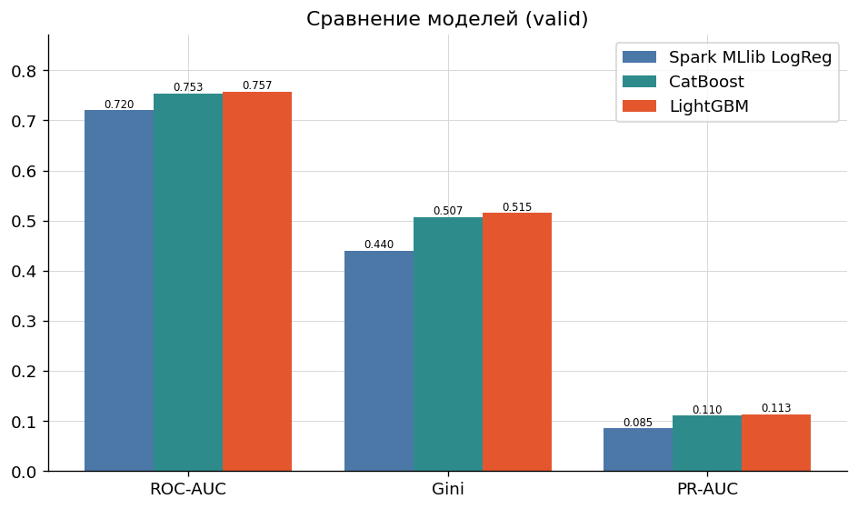

## 6. Оценка LightGBM (валидация, ≈599 тыс.)
ROC и PR-кривые (PR - с поправкой на базовый уровень 3.5%):
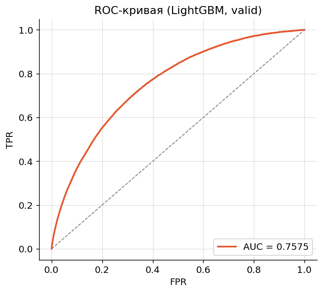 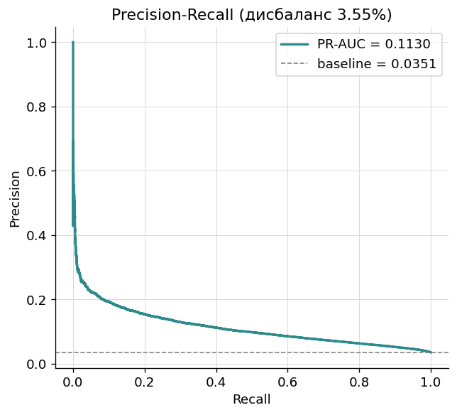

Разделимость скоров по классам и KS-статистика (0.381):
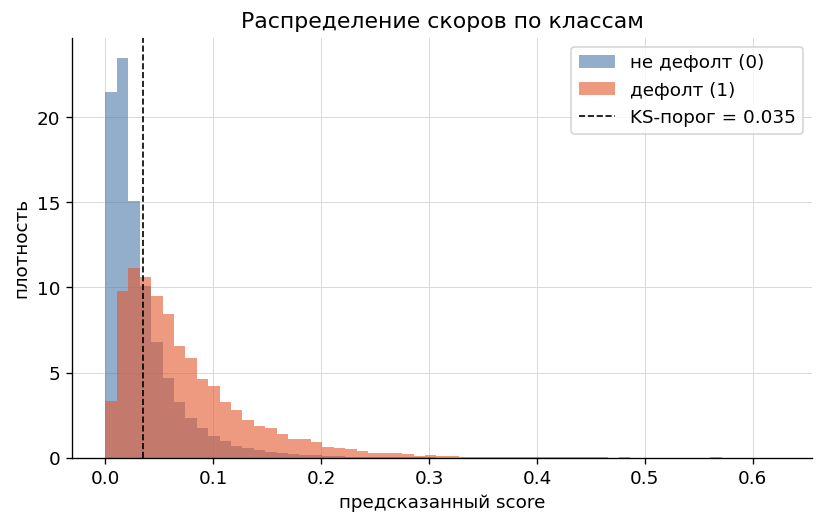 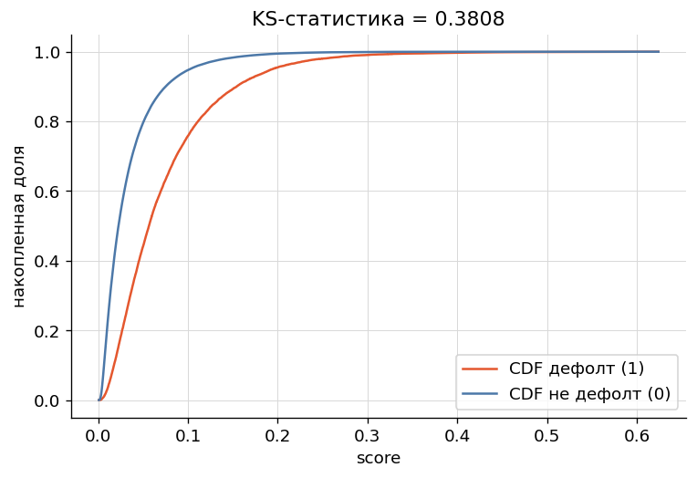

Калибровка - предсказанные вероятности близки к фактической частоте дефолта:
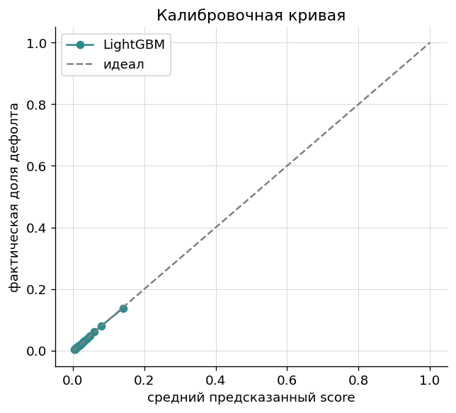

Матрица ошибок при KS-оптимальном пороге (0.035):
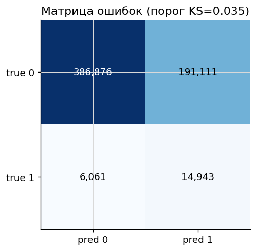

**Важность признаков (gain, top-30):** доминируют агрегаты платёжной дисциплины
(`enc_paym_*_mean`), флагов просрочки (`is_zero_loans*_mean`), утилизации (`pre_util`) и
типа кредита - что содержательно согласуется с логикой скоринга.
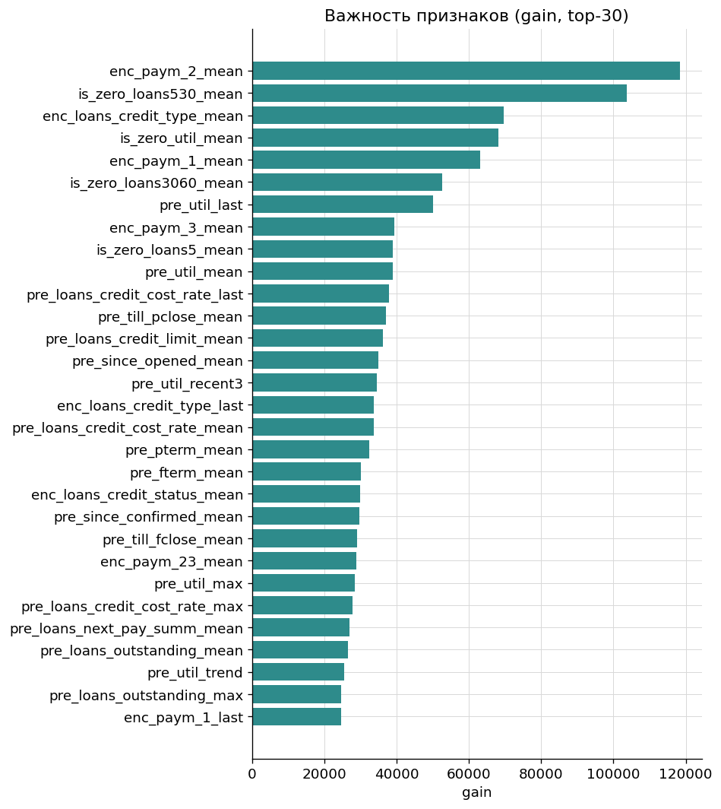

## 7. Выводы
- Агрегаты `mean/max/last` плюс оконные признаки (тренд/свежесть) по истории клиента дают
  **Gini 0.515** - крепкий результат для анонимизированных данных без ручного доменного инжиниринга.
- Градиентный бустинг устойчиво превосходит логистическую регрессию на этой задаче.
- Сигнал сосредоточен в платёжной дисциплине и просрочках - ожидаемо и интерпретируемо.

**Куда развивать:** добавить агрегаты `std/min/доли кодов`, целевое кодирование
категориальных `enc_*`, тюнинг гиперпараметров, калибровку (isotonic), OOF-валидацию по фолдам.
